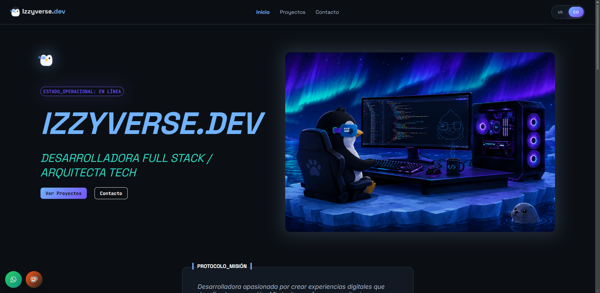
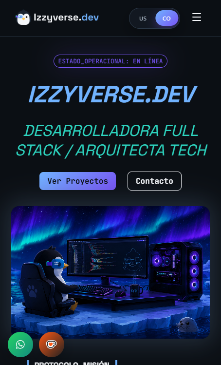

# Izzyverse Dev Portfolio

    

Izzyverse Dev Portfolio is a modern, responsive personal portfolio website built to showcase projects, skills, and professional experience.

## Overview

This portfolio is a web application built with React and Vite. It features internationalization (i18n), dynamic routing, and an email contact form powered by Resend. It provides a clean and interactive user experience for visitors to explore my work and get in touch.

## Stack

- **Framework**: React 19
- **Build Tool**: Vite 8
- **Language**: TypeScript
- **Styling**: Vanilla CSS & Sass
- **Routing**: React Router DOM 7
- **Internationalization**: i18next & react-i18next
- **Email API**: Resend (Serverless function via Vercel)
- **Analytics**: Vercel Analytics
- **Deployment**: Vercel

## Structure

```text
src/
├── assets/      # Static assets like images and icons
├── components/  # Reusable UI components
├── constants/   # Application constants and configuration
├── context/     # React context providers
├── data/        # Static data and content
├── hooks/       # Custom React hooks
├── pages/       # Main view components for routes
├── routes/      # Application routing configuration
├── styles/      # Global styles and Sass files
└── types/       # TypeScript type definitions
```

## Prerequisites

- Node.js (v18 or higher recommended)
- [pnpm](https://pnpm.io/) package manager

## Installing and Using

1. Clone the repository:
   ```bash
   git clone <repository-url>
   ```
2. Navigate to the project directory:
   ```bash
   cd Portfolio
   ```
3. Install dependencies:
   ```bash
   pnpm install
   ```

To run the development server:
```bash
pnpm run dev
```

## Build

To build the project for production:
```bash
pnpm run build
```

## Local Preview

To preview the production build locally:
```bash
pnpm run preview
```

## Linting

To run ESLint and check for code quality issues:
```bash
pnpm run lint
```

## Deploy

This project is configured for seamless deployment on [Vercel](https://vercel.com). Commits to the main branch trigger automatic deployments. The `api/` directory is used for serverless functions (like the contact form using Resend).

## Screenshots

### Desktop



### Mobile



## Architecture and Patterns

- **Component-Based Architecture**: UI is broken down into reusable and modular React components.
- **Custom Hooks**: Encapsulation of complex logic into custom React hooks (`src/hooks/`).
- **Serverless API**: Utilization of Vercel Serverless Functions (`api/` directory) for backend tasks like sending emails via Resend.
- **i18n**: Support for multiple languages using `i18next` with browser language detection and HTTP backend.
- **Context API**: Global state management using React Context (`src/context/`).

## Main features

- **Responsive Design**: Optimized for both desktop and mobile devices.
- **Multilingual Support**: Switch between different languages seamlessly.
- **Contact Form**: Functional contact form integrated with the Resend API.
- **Dynamic Routing**: Client-side routing with React Router.
- **Modern Styling**: Styled with Sass for maintainable and scalable CSS.

## Contribution

Contributions are welcome! Please feel free to submit a Pull Request or open an issue if you have suggestions or find bugs.
